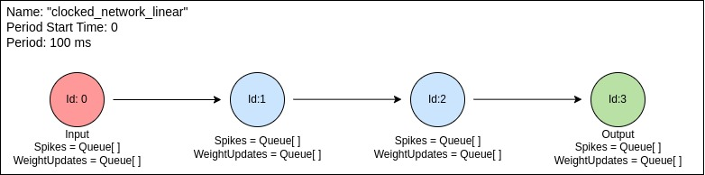
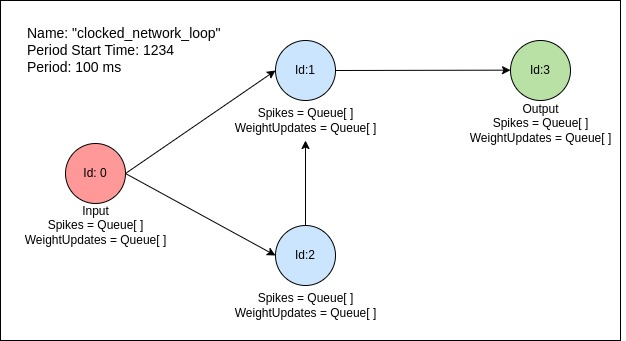
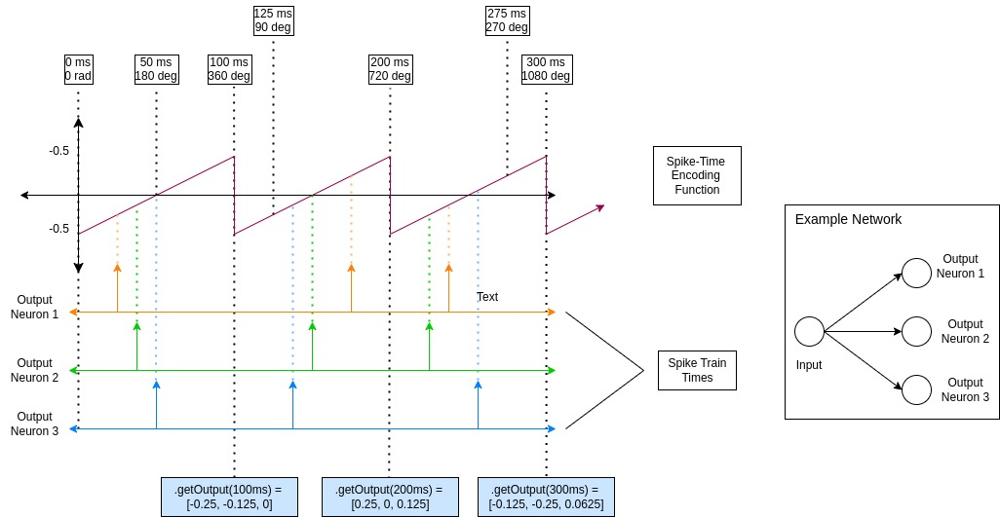

# Async Neural Architecture Design

## Quickstart
This project is still in development. Currently this project support initializing networks of neurons and retreiving their outputs through code.  
To run this project,
1. Clone this repo
2. Import the network class
3. Initialize a Network:

Example 1:
```
from neuron_net.src.models.Network import Network
net1_config = {
    "connections": {
        0: [1],
        1: [2],
        2: [3],
        3: [],
    },
    "input_list": [0],
    "output_list": [3],
}
return Network(
    net1_config["connections"],
    net1_config["input_list"],
    net1_config["output_list"],
    period_start_time=0,
    clock_cycle_period=100,
    name="clocked_network_linear",
)
```
This results in the following structure:


Example 2:
```
from neuron_net.src.models.Network import Network
net2_config = {
    "connections": {
        0: [1, 2],
        1: [3],
        2: [1],
        3: [],
    },
    "input_list": [0],
    "output_list": [3],
}

return Network(
    net2_config["connections"],
    net2_config["input_list"],
    net2_config["output_list"],
    period_start_time=1234,
    clock_cycle_period=100,
    name="clocked_network_loop",
)
```
Network 2: 




## Outline
1. [Purpose](#purpose)
2. [Background](#background)
3. [Requirements](#requirements)
4. [Design](#design)
5. [Results](#results)
6. [Deviations](#deviations)
7. [Future Work](#future)
8. [References](#references)

## Purpose
This project explores how using temporal encoding can represent more information than traditional neural networks, with the intuition that more efficient representations can lead to smarter and more powerful inferences. This project aims to establish a foundational framework for creating asynchronous neural networks (vaguely inspired by Spiking Neural Networks) that can exploit temporal encoding for more efficient representations and computations.

## Background
A key difference in Artificial Deep Neural Networks (ANN) and Biological Neural Networks (Human and Animal Nervous Systems) is the lack of temporal encoding. Deep neural networks are restricted to process information one forward pass at a time. But biological intelligence networks are free activate asynchronously (for the most part, as we shall see). Research by Anthropic has shown using mechanistic interpretability that Deep Neural Networks act as sparse autoencoders for abstract concepts and meta information. This means that deep neural networks learn representations (compressed encodings) in neuron weight patterns naturally through back-propagation. This is a surprising and powerful discovery. It implies that a system with learnable representations are (nearly) all you need for powerful AI. All current implementations of Deep Neural Networks activate sequentially, layer by layer. This imposes a representation constraint - without workarounds, neuron activations can be used for maximally 1 representation per forward pass. From this key insight, this project attempts to build a foundational neuronal network that maximized representational efficiecy by 1) exploiting temporal encoding as seen in biological networks and at the same time, 2) keep using vector embedding encoding as seen in traditional deep neural networks. 

The representational powers of artificial neural networks has been heavily explored in subfields of ML research like mechanistic interpretability. From a mathematical perspective, ANNs are universal function approximators with the power to fit any function using cascading sums of non-linear functions. These function approximators learn continuous vector representations of concepts and information. In addition, we see an emergent behavior of neural networks in accordance to scaling laws. Larger and deeper networks can represent exponentially more concepts. A prime visual example is examining the maximally activating image for neurons in layers of a convolutional neural network. Neurons in early layers respond strongly to low level features such as edges and visual patterns. Neurons in deeper, subsequent layers activate maximally to more complex aggregated features such as as vague outlines of class label images (ex. dog, cat, car).

A naive approach which leads to the common mistake found in most implementations of spiking neural networks (SNNs) abandons quantitative vector embeddings and instead solely relies on discretized spike rate encoding. This severely limits the amount of imformation networks can represent by several orders of magnitude. With the exception of a few, spiking neural network implementations do not follow the maximal representation paradigm as described here. Notably, Numenta and the paper Spiking Neural Networks with Weighted Spikes have implemented a version of value and temporal encoding combined, but neither leverage asynchronous clusters of neurons. 

To avoid representational power reduciton in spiking neural networks, an analogous mechanism for granular value embedding must be maintained to supplement attempts to enhance representational power via temporal encoding.

Fortunately, value encoding seems to have a natural analog that has been experimentally verified in multiple biolgical information networks. For instance, O'Keefe is know for his nobel prize winning work on the discovery of place cells. His subsequent work shows that the firing of place cells may be dual encoded together with the theta rhythm of EEG. 

Theta cycles are 8-12 Hz waves of electrical activity that are regulated by hyperpolarized cells in the thalamus. This can be thought of as a clocking mechanism to regulate areas of the brain, particularly the hippocampus for memory encoding and retrieval. Gamma cycles are high frequency electical cycles that occur in the brain. Furthermore, gamma cycles are nested within theta cycles with 5 - 8 gamma cycles occuring per theta period. In remarkable studies of place cells in mice, O'Keefe observed that place cells fired early and early with respect to theta phase as mice moved in the area. 

Personally, my first though when I learned about theta and gamma phase encoding was that it is deeply reminiscent of positional encoding in the original transformer architecture.

The clocking that we see in the brain via repetitive inibitory signals sent from the thalamus is by definition, a synchronous mechanism. This observation contrasts our first intuition that asychronous activations is better than synchronous processing. There seems to be a fundamental advantage of processing sequential information since there is information that is baked into the temporal sequences of experience. However, it is well known that the brain is locally synchronous, but globally asynchronous. So, while neurons don't have any inherent synchronous behavior, they have the option to behave synchronously when networked together.

To account for this local asynchrony, we can have a local synchronous clock signal as a reference value. Spikes in neurons that are received earlier in this clock cycle are encoded to a lower value than spikes that are received later in the local clock cycle. Asynchronous representations are still utilized in this model at 2 levels. First, each neuron's activations contribute to vector representations. And secondly, 2 individually synchronous networks can be wired together where they are independently asynchronous.
Thus, this newly proposed framework maximizes the representational power through temporal encoding while crucially maintaining the previously overlooked representational advantages (vector embeddings) of artificial neural networks. 

Exploring this paradigm of asynchronous neuron activations also sheds light on the nature of representation inside biolgical brains and may pioneer mechanistic interpretability for biological neural nets. Thus, the motivation of this project is biderectional; firstly from the frontiers of modeling biological neural networks, and at the same time, an attempt to equip artificial neural networks to exploit temporal encoding on top of existing vector embeddings for more efficient representations. 

The insights from neuroscience and the need for efficient representations serves as the core motivation for this project: implementing a highly efficient learner of representations. 

## Requirements
P0. A system that has mechanisms to able to encode information with respect to time.
P0. A system that has mechanisms to continuosly represent information more efficiently (Learn)
P0. A system that can initialize asynchronous groups of computational units. 
P0. Must be able to efficiently initialize large groups of neurons with predefined connections
P1. Must be a foundational service that creates building blocks for later experiments of asynchronous networks

## Design
This Async Netork uses a real time simulator at its core. Since truly asynchronous event-driven neuron behavior is not possible without specialized hardware, a simulation using clock cycles was chosen. 
### Learning Method
A key difference in biological learning and ANNs is the learning method. ANNs use gradient descent with back propagation to update neuron to neuron connections/weights. 
This learning mechanism does not exist in biological neurons. Rather, according to neuroscience, neurons in the brain follow a learning rule called "Hebbian Learning", which can be summarized by the phrase: "Neurons that fire together, wire together". 
The proposed learning rule used periodic synapse updates. After N simulation cycles, all neurons will update their own synapses based on the Spike-timing dependent plasticity rule. This requires Neurons to also keep track of all upcoming synapse weight updates.
STDP was used to formulate the learning method of neurons. The learning rules for increased connectivity and decreased connectivity are described below. 
To keep this project in scope, 
### Value Embeddings
As mentioned in the [background](#background), the closest and most efficient implementation of value embeddings in spiking neural networks is to use a phase encoding. The encoding function maps the timing of neuron firings to the clock phases of the network it is located in.
### Neurons
Neurons are the core learning components in the network. They are responsible for maintaining their own incoming spikes and their own synapse weight updates. While incoming spikes are passed from origin to destination. On the event of coincident firing, the neuron that received the coincident spike notifies the sending neuron to update its synaptic weight at the next update event. 
*** INSERT IMAGE HERE ***
### Synapses
Synapses only exist in the context of their origin neurons. This reduces memory overhead by reducing the redundant information of origin/parent neurons. 
### Network
Neurons maintain their own synapse connections, updates, and update events in their respective data structures. The network serves as the interface between the environment and the internal computations of neuron graphs. In a large network, the roNetworks also are responsible for converting output spikes to interpretable actions for the action space. The choses implementation uses a weighted probabalistic interpretation of the last C simulation cycles 
The next question to answer is should and how inputs to the network clusters should be encoded. 


This allows the network to have asynchronous representations inside the network but still have synchronzied interpretable outputs. 

## Results
The foundational modelling tools used to create neuronal networks with phase encoding has been developed. The core functionality including initializing groups of neurons, the learning mechanism (Spike-Timing-Dependent Plasticity) in which neurons fire together, wire together, phase encoding using synchronous network clocks to translate spike timing to vector embeddings, and output retrieval.

## Future Work
The following gives a "To-Do" list for this project in order.
### Training and Testing on data. 
The most important next step is to use this model to learn. This involves first determining a good learning environment. Certain elements of this model like the input formulation will need to be adapted to each use case. For example, reinforcement learning environments will need to have an interface or wrapper for the model to receive observations from an environment and computer vision tasks will need to convert image inputs to feed into neuron network inputs. Hyperparamters will most likely need to be tuned for each use case as well. 
### Visualization 
This project would massively benefit from visualization and a "tensorboard" equivalent for spiking neural networks. Since this implementation uses temporal encoding, a real time dashboard that can iterate and visualize the activity of neurons at each time step would be optimal. 
### Network Initialization
The next hardest technical challege is by far determining the starting configuration of network connections. It has been observed that neuron connections in the brain have the characteristics of small world networks. Small world networks have the 2 properties of high clustering (nodes tend to form tightly connected groups) and short average path lengths (any two nodes can be connected through relatively few intermediary connections). One way to create such networks is the popular Watts-Strogatz model, which starts with a regular ring lattice and rewires some connections at random to create shortcuts across the network. However, a hypothesis that needs to be tested is whether small world networks arise from the process of pruning over connected nodes, such as how brains are wired in childhood and pruned in adulthood. If this is the case, over connected networks serve as great starting points for this model architecture to prune into optimal representational machines.
### Networks of Networks 
The next feature is the task of network integration. Each network cluster of neurons can have different clock rates to allow for flexible asynchronous processing. These outputs need to be integrated back together, similar to how the brain's visual and auditory cortices, and the hippocampus have distict routing to the prefrontal cortex. These asynchronous brain regions send outputs to a central processing center. The async neuronal network requires similar routing. This will involve initializing a group of networks, and route them to each other. 
### GPU integration
Industry and Acadamia have not seen much success in spiking neural networks with asynchronous characteristics despite their theoretical benefifs because of the widespread success of current implementations of synchronous networks because of the continuing improvements of GPUs. This spiking neural network implementation could massively benefit from GPUs or neuromorphic architecture. This is worth looking into after training and testing to establish what parameters, learning strategies, and encoding methods are effective.

## Project Summary
This pet project was mostly a personal foray into computational neuroscience. There are some key insights I had while having conversations and thoughts about mechanistic interpretability and asynchronicity inside the human brain. The two main insights were that value encoding is exceptionally valuable and many implementations of spiking neural networks were taking the representational power of traditional neural networks for granted, AND that traditional neural networks are nowhere near efficient at representing/encoding information as efficiently as biological neural networks. This led to the hypothesis that biological intelligence is comprised of many asynchronous clusters of synchronous neurons within those clusters.

## References
1. Toy Models of Representation
2. Gamma Cycles
3. Population Coding
